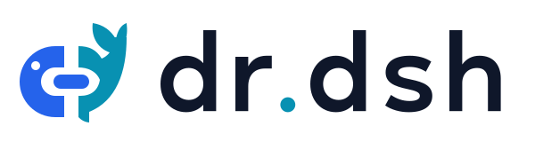

# dr.dsh

<picture>
  <source media="(prefers-color-scheme: dark)" srcset="assets/brand/logo-dark.svg">
  
</picture>

English | [中文](README.zh.md)

**Use the DeepSeek Harness on your own computer from a phone or another computer's browser.**

dr.dsh provides remote access to the real DSH interface, process management, and device pairing.
DSH runs on your computer. Session traffic is encrypted end to end between the browser and daemon,
through a relay you host.

## Two independent components

| | Relay: your server | Daemon: your DSH computer |
| :--- | :--- | :--- |
| Features | Serves the browser client (PWA), forwards encrypted traffic, provides keepalive and health checks | Manages local DSH, pairs devices, establishes encrypted tunnels, records audit and crash reports |
| Where to install | Your server, or the same host as the daemon | A computer with DSH installed |
| Install | [One command](#1-install-relay) | [One command](#2-install-daemon) |
| Management command | `drdsh relay` | `drdsh daemon` |
| Separate guide | **[Relay setup and usage](relay/README.md)** | **[Daemon setup and usage](daemon/README.md)** |

Each has its own configuration, program directory, logs, services, and update lock. Updating or
uninstalling one does not restart or uninstall the other. Restarting the relay interrupts connections
and requires reconnection; the DSH process keeps running.

```text
Phone / browser ⇄ Relay (server + PWA) ⇄ Daemon (your computer) → DSH
```

**Version `0.1.1` is available as GitHub Release binaries.** Linux x86_64 musl has mixed, relay-only and
 daemon-only packages; macOS Apple Silicon has a daemon package. All use the same native CLI source,
with identical executable bytes per platform and package metadata selecting available commands. `drdsh-relay` / `drdsh-daemon` are name-based aliases.
See [release installation](docs/operations/releases.md). No npm package, hosted relay or third-party audit is available.

## Quick start

Install directly from GitHub Releases with `curl`. The script detects your OS and CPU, downloads
the matching package and verifies SHA-256. Run each command on the machine that needs that component.
Installation needs curl, tar and sha256sum or shasum; it needs no Git, Rust, pnpm or management-time Node.
The daemon host still needs Node and a configured DSH. Services use Linux systemd user sessions or macOS desktop login sessions.
Install relay on Linux x86_64 below; daemon can run there or on an Apple Silicon Mac.
Both components can run on the same Linux computer; choose the mixed package below for that setup.

### 1. Install Relay

The installer downloads relay and its prebuilt PWA from Release, then verifies SHA-256:

```sh
curl -fsSL https://raw.githubusercontent.com/luckyuro/dr.dsh/master/relay/install.sh | sh -s -- --start
export PATH="$HOME/.local/bin:$PATH"
drdsh relay status
```

When status says `relay health: responding`, the relay is ready. It listens on `127.0.0.1:8787` by
default. For phones and other computers, use a domain such as `https://relay.example.com`:
point DNS at your server and proxy HTTPS to the local relay. See the
[custom domain setup](relay/README.md#custom-domain). Keep `--bind` as the local IP and port.

### 2. Install Daemon

Run on the DSH computer. Set `--relay` to your relay's WebSocket origin, using its actual `ws://`
or `wss://` scheme. The example uses a same-host relay; for an HTTPS domain, use
`--relay wss://relay.example.com` with the [updated daemon build](daemon/README.md#connect-to-a-remote-relay).
Replace `/absolute/path/to/dsh` with the installed **DeepSeek Harness executable**
(use `command -v dsh` to locate it):

```sh
curl -fsSL https://raw.githubusercontent.com/luckyuro/dr.dsh/master/daemon/install.sh | sh -s -- \
  --dsh /absolute/path/to/dsh --relay ws://127.0.0.1:8787 --start
export PATH="$HOME/.local/bin:$PATH"
drdsh daemon status
```

`--dsh` selects the program; optional `--workdir /path/to/your/project` selects its startup working
directory. On first installation, omitting these uses `dsh` from PATH and the current directory;
reinstallation retains saved values. Add `--port 3081` if an existing DSH uses `3080`.
See [Git clone and npm path examples](daemon/README.md#dsh-installation-methods) and
[optional SSH forwarding](daemon/README.md#optional-ssh-forwarding).
The installer does not install or configure upstream DSH. The integration baseline is DSH
`0.1.5-rc.2`; check compatibility after upstream updates.

Both management commands install under `~/.local/bin` by default. The `export` affects only the
current terminal; add it to your shell configuration for later use.

For both components on Linux:

```sh
curl -fsSL https://raw.githubusercontent.com/luckyuro/dr.dsh/master/install.sh | sh -s -- \
  --component mixed --dsh /absolute/path/to/dsh --start
```

Omit `--start` to install without starting services. Add `--enable` for login autostart.
The root installer defaults to mixed on Linux and daemon on macOS. You can also set options through
environment variables on the **`sh` side** of the pipe; command-line options take precedence:

```sh
curl -fsSL https://raw.githubusercontent.com/luckyuro/dr.dsh/master/install.sh | \
  DRDSH_COMPONENT=daemon DRDSH_VERSION=v0.1.1 DRDSH_PREFIX="$HOME/.local" sh
```

`DRDSH_VERSION` defaults to `latest`; `DRDSH_PREFIX` defaults to `~/.local`. See
[installation options and offline packages](docs/operations/releases.md) for details.

### 3. Pair and open DSH

Run on the DSH computer and leave the command waiting:

```sh
drdsh daemon pair
```

1. Open the relay's HTTPS address in your browser. For a same-host trial, use the [local relay](http://127.0.0.1:8787).
2. Enter the terminal's code under **Pairing code or room key** and click **Connect**.
3. After **Paired** appears, click **Connect** again to establish the tunnel.
4. Click **Open the DeepSeek Harness interface** to use DSH in a new tab.

**Keep the original dr.dsh tab open:** it maintains the connection. Codes are single-use and valid
for about five minutes; generate a new one after failure or expiry. Your browser remembers pairings
for later visits and can add several computers.

The PWA supports English and Simplified Chinese. It initially follows your browser's preferred
supported language (falling back to English). Use **中文 / English** in the upper right to switch;
your choice is remembered for this relay, works offline, and leaves the connection open.
The tunneled DSH interface keeps its own language settings.

## Everyday management

| Operation | Relay | Daemon |
| :--- | :--- | :--- |
| Start | `drdsh relay start` | `drdsh daemon start` |
| Stop | `drdsh relay stop` | `drdsh daemon stop` |
| Restart | `drdsh relay restart` | `drdsh daemon restart` |
| Status | `drdsh relay status` | `drdsh daemon status` |
| Follow logs | `drdsh relay logs --follow` | `drdsh daemon logs --follow` |
| Login autostart | `drdsh relay enable` | `drdsh daemon enable` |
| Update from Release | `drdsh relay update` | `drdsh daemon update` |
| Uninstall | `drdsh relay uninstall` | `drdsh daemon uninstall` |

Use `disable` to cancel login autostart and `stop` to stop a running service. Uninstalling preserves
each component's configuration and logs, and the daemon's pairing data. Relay includes the PWA;
add `--with-plugin` during installation, or use `drdsh daemon install plugin --source <bundle>`.

Legacy unified installations use `scripts/install-legacy.sh` and their existing command.
The new `install.sh` installs from Release. Existing users should follow the
[migration guide](docs/operations/cli.md#从旧版安装迁移) to preserve pairings.

## Current requirements and limits

- Keep the DSH computer powered on, awake, and online.
- Remote browsers need HTTPS. The daemon supports both WS and WSS, selected by the scheme in `--relay`.
- Background push and the receiver for supplementary plugin notifications are not implemented. Handle approvals and questions in the real DSH interface while connected.
- The relay also distributes client code, so its infrastructure must be trusted. There has been no third-party security audit; see the [security model](docs/security.md).

## Documentation and development

- **[Relay guide](relay/README.md)**: independent installation, commands, configuration, and Docker.
- **[Daemon guide](daemon/README.md)**: independent installation, remote connections, pairing, plugins, and state backups.
- [Full CLI and migration](docs/operations/cli.md), [troubleshooting](docs/operations/troubleshooting.md), [MVP status](docs/product/mvp.md).
- [Architecture](docs/architecture.md), [design decisions](docs/decisions/README.md), [contributing](docs/development/contributing.md), [repository rules](AGENTS.md).

Detailed documentation under `docs/` is currently in Chinese.

```sh
pnpm install
pnpm run verify
```

## License

MIT.
